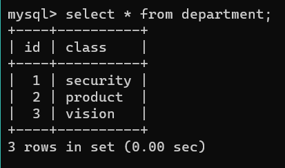
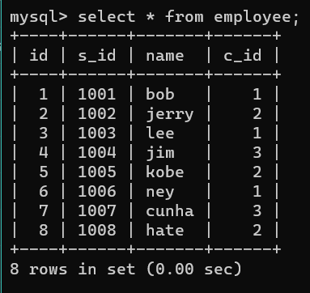
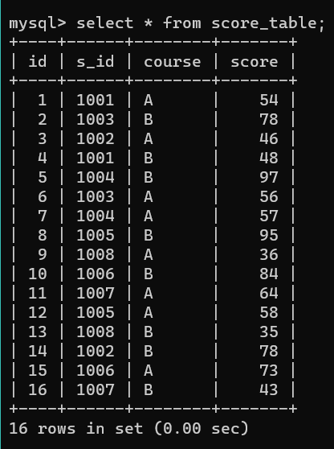
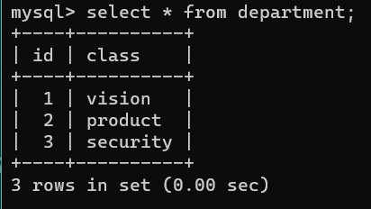
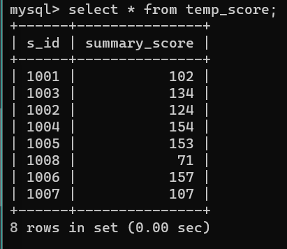
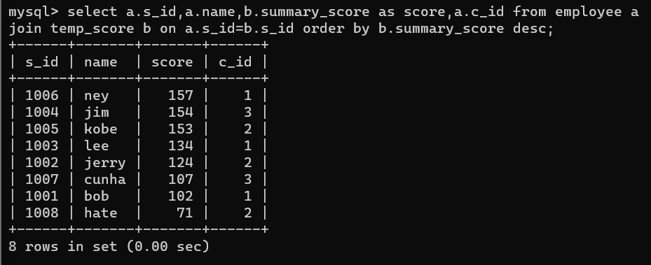
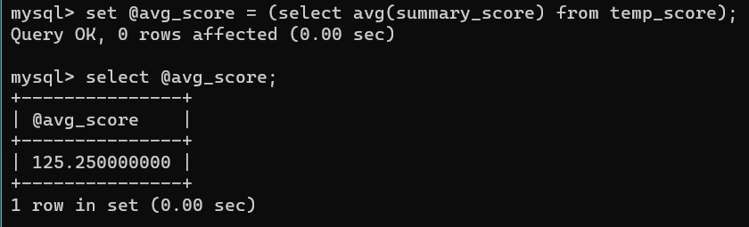
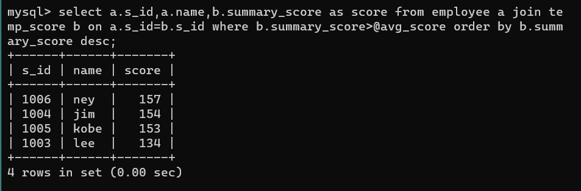

# 数据库作业

by zhangxinhui02

------


### 提交要求

1. *附上创建初始三个表的sql语句*
2. *附上三个表插入数据后的截图*
3. *附上任务2、3、4的sql语句和表截图*


------


### 任务

- #### 创建初始的三个表并插入数据


创建表1：部门表(department)

```mysql
# 选择数据库部分略
create table department(
	id int unsigned not null,
	class varchar(8) not null,
	primary key (id)
	) ENGINE=InnoDB DEFAULT CHARSET=utf8mb4;
```

创建表2：员工表(employee)

```mysql
create table employee(
	id int unsigned not null,
	s_id int unsigned not null,
	name varchar(5) not null,
	c_id int unsigned not null,
	primary key (s_id)
	) ENGINE=InnoDB DEFAULT CHARSET=utf8mb4;
```

创建表3：成绩考察表(score_table)

```mysql
create table score_table(
	id int unsigned not null auto_increment,
	s_id int unsigned not null,
	course varchar(1) not null,
	score int unsigned not null,
	primary key (id)
	) ENGINE=InnoDB DEFAULT CHARSET=utf8mb4;
```

插入数据语句略，插入后截图如下：








- #### 将***部门表***的***security***和***vison***交换***ID***，即***vision***为***1***，***security***为***3***（注意只对***ID***操作）


语句：

```mysql
# 将sequrity部门的id临时更改为0，以避免vision部门id修改为1引起的冲突。
update department set id=0 where class='security';
update department set id=1 where class='vision';
update department set id=3 where class='security';
```

交换后的截图：




- #### 通过***成绩考察表***和***mysql函数***，算出每人AB成绩总和，并通过***成绩考察表***和***员工表***的***s_id***和***c_id***    将***员工表***的***name***连接其中，并将成绩由高到第低排序，形成结构下表（注意别名）

| s_id | name | score（每人AB成绩总和） | c_id |
| ---- | ---- | ----------------------- | ---- |


新建临时表，计算每人成绩总和并显示：

```mysql
# 创建MySql临时表，临时存储成绩信息
create temporary table temp_score(
	s_id int unsigned not null,
	summary_score int unsigned not null
	) ENGINE=InnoDB DEFAULT CHARSET=utf8mb4;
# 将成绩按s_id分组，求和后插入临时表
insert into temp_score
	(s_id,summary_score)
	select s_id,sum(score) as summary_score from score_table group by s_id;
# 输出
select * from temp_score;
```

截图：



连接临时表与员工表，并按成绩由高到低进行排序：

```mysql
select a.s_id,a.name,b.summary_score as score,a.c_id from employee a join temp_score b on a.s_id=b.s_id order by b.summary_score desc;
```

截图：




- #### 算出平均值，再筛选出比平均值高的人，形成结构下表

| s_id | name | score |
| ---- | ---- | ----- |


计算平均值并筛选：

```mysql
# 计算总分score列的平均值，存储到变量中，输出平均值
set @avg_score = (select avg(summary_score) from temp_score);
select @avg_score;
# 筛选并输出高于平均值的人
select a.s_id,a.name,b.summary_score as score from employee a join temp_score b on a.s_id=b.s_id where b.summary_score>@avg_score order by b.summary_score desc;
```

计算并输出平均值截图：



筛选并输出高于平均值的人：



